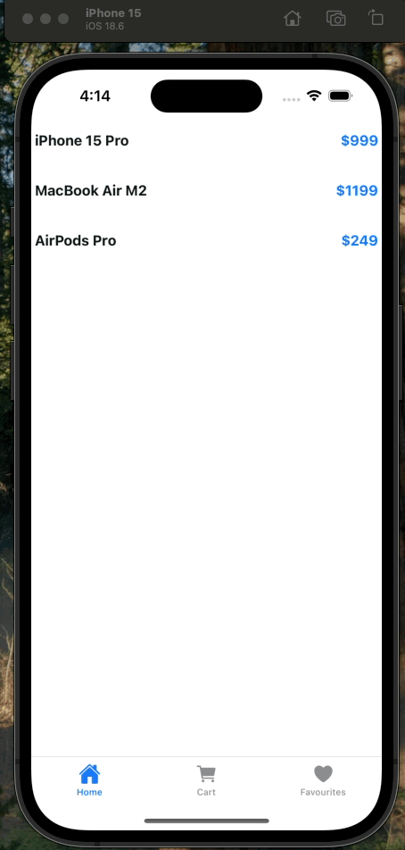

# Gerald Challenge - React Native App 👋

This is a [React Native](https://reactnative.dev) project built with [Expo](https://expo.dev) and [Expo Router](https://docs.expo.dev/router/introduction/) for navigation.

## Demo



## App Architecture

This app implements a sophisticated navigation structure using **Expo Router** with file-based routing:

### Navigation Structure

```
Root Layout (Drawer Navigator)
├── (home) - Home Section
│   ├── Tab Navigator
│   │   ├── index - Home Screen
│   │   ├── cart - Cart Screen
│   │   └── favourites - Favourites Screen
│   └── Stack Navigator (Products)
│       ├── products/index - Products List
│       └── products/[id] - Product Detail
└── (orders) - Orders Section
    └── index - Orders Screen
```

### Navigation Components

1. **Drawer Navigator** (`app/_layout.tsx`)

   - Main navigation container
   - Provides side drawer menu
   - Contains two main sections: Home and Orders
   - Customizable drawer styling with dark/light theme support

2. **Tab Navigator** (`app/(home)/_layout.tsx`)

   - Located within the Home section
   - Bottom tab navigation with three tabs:
     - **Home**: Main landing page
     - **Cart**: Shopping cart functionality
     - **Favourites**: Saved items
   - Uses Ionicons for tab icons

3. **Stack Navigator** (Products)
   - Nested within the Home section
   - Handles product-related screens:
     - **Products List**: `app/(home)/products/index.tsx`
     - **Product Detail**: `app/(home)/products/[id].tsx` (dynamic routing)

### Key Features

- **File-based Routing**: Uses Expo Router for intuitive navigation structure
- **Type Safety**: Full TypeScript support with custom type definitions
- **Theme Support**: Dark/light theme with automatic system detection
- **Custom Components**: Themed components for consistent UI
- **Product Management**: Dynamic product routing with parameter passing

## Project Structure

```
app/
├── _layout.tsx              # Root drawer navigator
├── (home)/                  # Home section with tab navigation
│   ├── _layout.tsx         # Tab navigator configuration
│   ├── index.tsx           # Home screen
│   ├── cart.tsx            # Cart screen
│   ├── favourites.tsx      # Favourites screen
│   └── products/           # Product stack navigator
│       ├── index.tsx       # Products list
│       └── [id].tsx        # Product detail (dynamic)
└── (orders)/               # Orders section
    ├── _layout.tsx         # Orders layout
    └── index.tsx           # Orders screen
```

## Getting Started

### Prerequisites

- Node.js (v16 or higher)
- npm or yarn
- Expo CLI (`npm install -g @expo/cli`)

### Installation

1. Install dependencies

   ```bash
   npm install
   ```

2. Start the development server

   ```bash
   npx expo start
   ```

### Running the App

After starting the development server, you can run the app on:

- **iOS Simulator**: Press `i` in the terminal or scan the QR code with Expo Go
- **Android Emulator**: Press `a` in the terminal
- **Physical Device**: Scan the QR code with the Expo Go app
- **Web Browser**: Press `w` in the terminal

## Development

### Key Directories

- `app/`: Main application screens and navigation
- `components/`: Reusable UI components
- `constants/`: App constants and data
- `hooks/`: Custom React hooks
- `types/`: TypeScript type definitions

### Navigation Patterns

- **Drawer Navigation**: Access via swipe gesture or hamburger menu
- **Tab Navigation**: Bottom tabs for quick access to main features
- **Stack Navigation**: Push/pop navigation for detailed views
